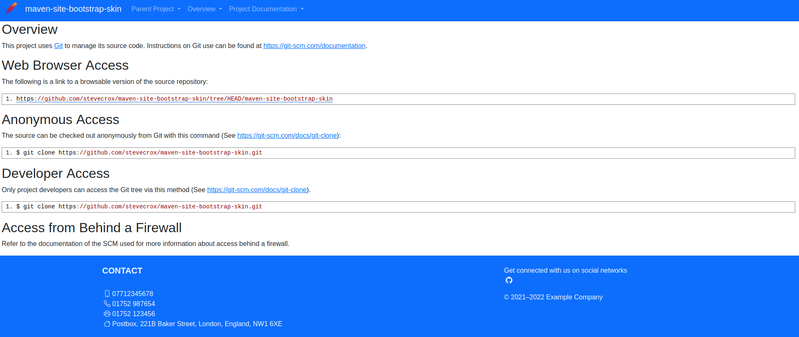
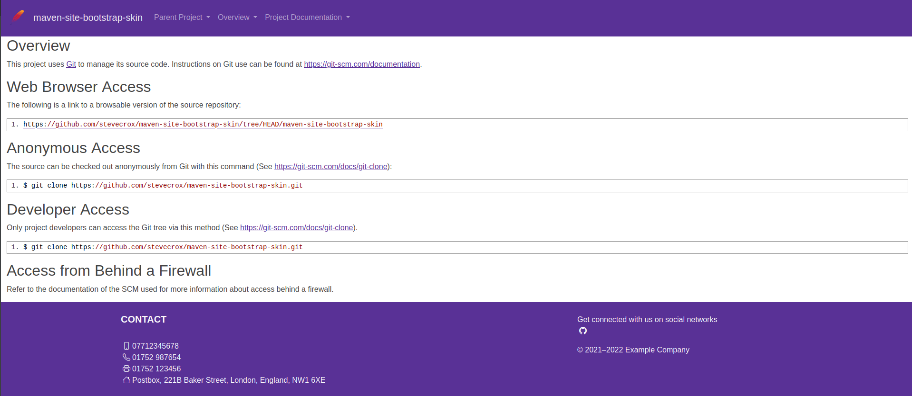

# Maven Site Bootstrap Skin

This is a skin to be used by the maven-site-plugin, the default skin uses legacy versions of jQuery and embed a number of older Apache Images. The goal of this skin is to provide a Modern Bootstrap 5 wrapping of the Maven Site, allowing you to configure various aspects to better tailor the layout to your desired layout.

It allows you to supply a [Bootswatch Theme](https://bootswatch.com/) as a CSS file as well as other additional CSS. 

## Default Example

If you don't set any of the options, the above image is the default generated by the skin.

## Full Example

I've modified the custom setting to show how the resulting site can be better tailored to your layout needs.
