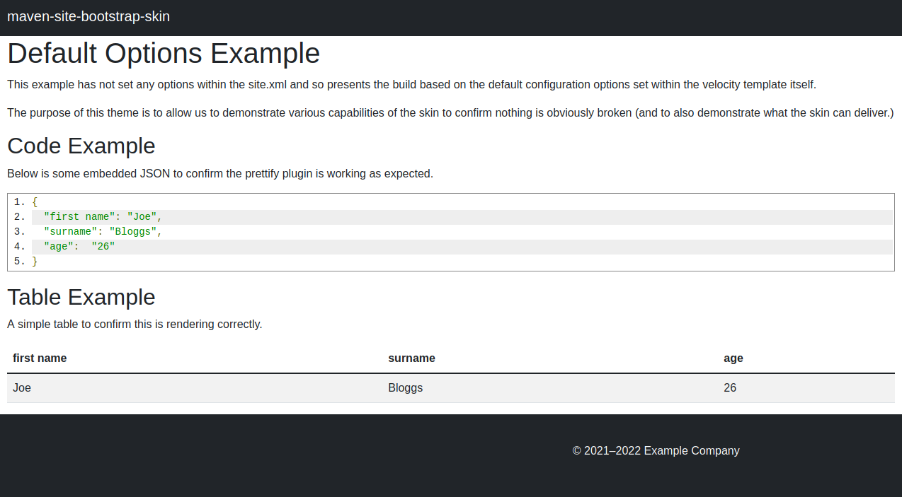
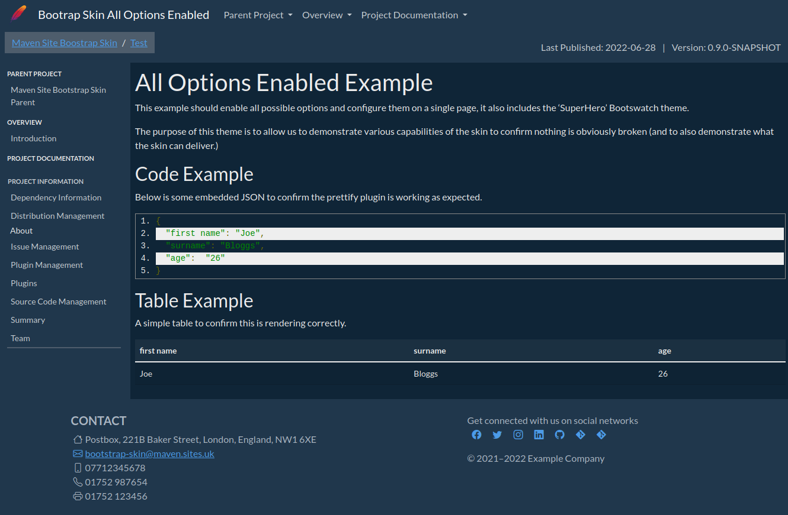

# Skin Examples

This page contains a number of examples of supported skin layouts.

## Default Example

The above image was generated with no banner or custom sections included in the `site.xml`.  This represents the default layout and look of the skin.

## Full Example

In the above image the `site.xml` has every possible configuration set, this version includes breadcrumbs, version, date, banners a sidebar, contact details as well as social media. I could have disabled the navigation bar but settled for requested the alignment of the drop downs to change. Lastly the site directory contains a `maven-theme.css` file which includes the Superhero Bootswatch theme to add colouring to the website.