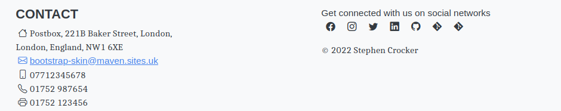

# Footer
<hr/>
The footer allows you to insert various kinds of contact information.



Each element within the footer requires user information to be included within the custom element of the `site.xml`. This page will outline each option. The current design splits the footer into two vertical columns. The left side contains contact information, while the right contains social media, copyright and powered by sections.

## Footer Style

You are able to modify the CSS classes applied to the footer element on the HTML page by setting the `<footer><style>` element. The default value is `footer mt-auto py-4 bg-light`.

```xml
<project name="xxx">
  [...]
  <custom>
    <bootstrapSkin>
      <footer>
        <style>footer mt-auto py-4 bg-light</style>
      </footer>
    </bootstrapSkin>
  </custom>
  [...]
</project>
```

## Contact Section

The Contact section, allows you to define various electronic and physical contact methods.  Not all sections need to be completed, the system will simply skip empty blocks. Below is an example 

```xml
<project name="xxx">
  [...]
  <custom>
    <bootstrapSkin>
      <contact>
        <email>bootstrap-skin@maven.sites.uk</email>
        <fax>01752 123456</fax>
        <mobile>07712345678</mobile>
        <landline>01752 987654</landline>
        <address>
          <line1>Postbox</line1>
          <line2>221B Baker Street</line2>
          <city>London</city>
          <county>London</county>
          <country>England</country>
          <post_code>NW1 6XE</post_code>
        </address>
      </contact>
    </bootstrapSkin>
  </custom>
  [...]
</project>
```

## Social Media

The Social Media bar places the brand icon (from bootstrap-icons) into a singular line with a link to the supplied account, allowing organisations to provide this information in a way which does not link information to external services.

### Facebook
You can provide a link to a Facebook group by creating a Facebook element and adding the Facebook group identifier. 

```xml
<project name="xxx">
  [...]
  <custom>
    <bootstrapSkin>
      <facebook>
        <groupId>example</groupId>
      </facebook>
    </bootstrapSkin>
  </custom>
  [...]
</project>
```

The above configuration will create a link to `https://facebook.com/example`.

### Instagram
You can provide a link to an Instagram account by creating an Instagram element and adding the LinkedIn account identifier.

```xml
<project name="xxx">
  [...]
  <custom>
    <bootstrapSkin>
      <linkedin>
        <accountId>example</accountId>
      </linkedin>
    </bootstrapSkin>
  </custom>
  [...]
</project>
```

The above configuration will create a link to `https://linkedin.com/example`.

### LinkedIn
You can provide a link to Instagram group by creating a Instagram element and adding the Instagram account identifier.

```xml
<project name="xxx">
  [...]
  <custom>
    <bootstrapSkin>
      <instagram>
        <accountId>example</accountId>
      </instagram>
    </bootstrapSkin>
  </custom>
  [...]
</project>
```

The above configuration will create a link to `https://instagram.com/example`.

### Twitter
You can provide a link to a Twitter profile by creating a Twitter element and adding the account identifier.

```xml
<project name="xxx">
  [...]
  <custom>
    <bootstrapSkin>
      <twitter>
        <accountId>example</accountId>
      </twitter>
    </bootstrapSkin>
  </custom>
  [...]
</project>
```
The above configuration will create a link to `https://twitter.com/example`.


#### Twitter
I have added a Twitter element to ensure the footer has some content and the icon should appear on the right side of the footer. This will create the url `https://twitter.com/stevecrox0914`

```xml
<project name="xxx">
  [...]
  <custom>
    <bootstrapSkin>
      <twitter>
        <accountId>stevecrox0914</accountId>
      </twitter>
    </bootstrapSkin>
  </custom>
  [...]
</project>
```

### Source Control Management (SCM)

As part of the Social Media bar you are able to include links to the project. The following configurations are supported.

### Bitbucket

Bitbucket is one of several source control management solutions supported in the media bar, the Bitbucket element has 2 attributes, `project` and `repository`. `project` is the Bitbucket user/organisation to whom the repository belongs, while `repository` is the Bitbucket repository name. The skin will use this to build the URL with the path `https://bitbucket.com/<project>/<repository>`

```xml
<project name="xxx">
  [...]
  <custom>
    <bootstrapSkin>
        <gitHub>
            <project>stevecrox</project>
            <repository>maven-site-bootstrap-skin</repository>
        </gitHub>
    </bootstrapSkin>
  </custom>
  [...]
</project>
```

### GitHub

Github is one of several source control management solutions supported in the media bar, the Github element has 2 attributes, `organisation` and `repository`. `organisation` is the Github user/organisation to whom the repository belongs, while `repository` is the Github repository name. The skin will use this to build the URL with the path `https://github.com/<organisation>/<repository>`

```xml
<project name="xxx">
  [...]
  <custom>
    <bootstrapSkin>
        <gitHub>
            <organisation>stevecrox</organisation>
            <repository>maven-site-bootstrap-skin</repository>
        </gitHub>
    </bootstrapSkin>
  </custom>
  [...]
</project>
```

### GitLab

GitLab is one of several source control management solutions supported in the media bar, the GitLab element has 2 attributes, `project` and `repository`. `GitLab` is the GitLab user/organisation to whom the repository belongs, while `repository` is the GitLab repository name. The skin will use this to build the URL with the path `https://gitlab.com/<project>/<repository>`

```xml
<project name="xxx">
    [...]
    <custom>
        <bootstrapSkin>
            <gitHub>
                <project>stevecrox</project>
                <repository>maven-site-bootstrap-skin</repository>
            </gitHub>
        </bootstrapSkin>
    </custom>
    [...]
</project>
```